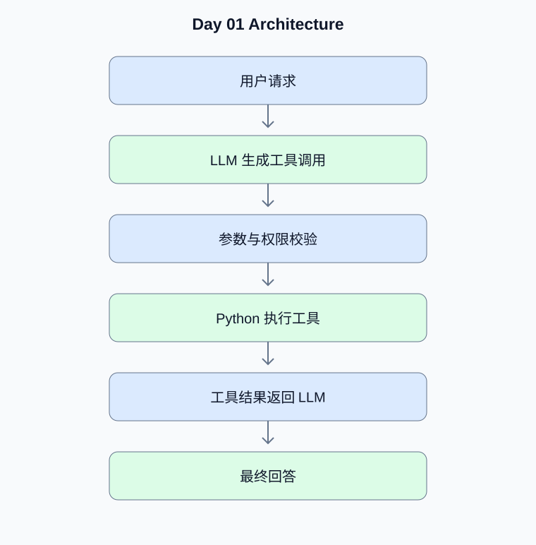

# Day 01：LLM 原理、Function Calling 与最小 Agent

[返回课程主页](../../README.md) · [每日面试题](./interview.md) · [学习进度](./progress.md)

> 学习时间：4–5 小时。今日交付：使用云端 API 或 Ollama 实现一个能够真实调用 Python 工具的 Agent。

## 一、今天要解决什么问题

使用云端 API 或 Ollama 实现一个能够真实调用 Python 工具的 Agent。

学习顺序：原理理解 → 真实代码 → 测试验证 → Python 复习 → 面试训练。

## 二、核心原理

### 1. LLM 与 Token

**原理：**大语言模型通常按 Token 逐步预测后续内容。Token 不等于汉字或单词，实际消耗由模型对应的 Tokenizer 决定。上下文窗口包含系统提示、历史消息、工具定义、工具结果和模型输出预算。

**动手验证：**比较同一段中文、英文和 JSON 的 Token 消耗；记录输入与输出 Token。

### 2. Function Calling

**原理：**模型不直接执行 Python 函数，而是生成结构化的工具调用请求。应用程序负责验证工具名称、参数和权限，执行真实函数，再把工具结果作为消息传回模型。模型返回的参数始终是不可信输入。

**动手验证：**实现工具白名单、Pydantic 参数校验、工具执行上限和错误处理。

### 3. Agent 与 Workflow

**原理：**Workflow 的执行路径主要由程序预先定义；Agent 可以根据模型判断动态选择工具或下一步操作。动态决策提高灵活性，也增加成本、不可预测性和安全风险。

**动手验证：**分别实现固定工具流程和模型自主选择工具的流程，比较可控性。

## 三、架构示例图



[查看可编辑的 Mermaid 图表源码](./images/architecture.mmd)

## 四、工程实战

- [ ] 配置 OPENAI_API_KEY 或 Ollama 本地服务
- [ ] 运行真实模型的普通聊天请求
- [ ] 运行 Function Calling 示例
- [ ] 验证工具参数并限制执行轮次
- [ ] 为合法参数和非法参数分别编写测试

### 工程验收要求

- 外部输入必须经过类型、范围和权限校验。
- 模型生成的工具参数不能直接作为可信业务参数。
- 网络调用需要设置超时；有副作用的工具需要考虑幂等。
- 至少编写一个正常场景测试和一个异常场景测试。
- 记录实际运行结果，而不是只保留示例输出。

### 今日代码位置

`src/` 保存当天练习代码，`tests/` 保存测试。
毕业项目的长期代码放在仓库根目录的 `project/` 中。

## 五、Python 高级面试复习


## Python 1：Python 函数参数究竟如何传递？

**参考答案：**Python 将对象引用绑定到函数的局部参数名。函数内部重新绑定参数名，不会修改调用方的变量绑定；但如果参数指向可变对象，原地修改会被调用方观察到。

**面试官追问：**为什么 list.append() 与 a = a + [1] 的行为可能不同？

**追问参考答案：**append() 原地修改原列表，因此持有该列表引用的调用方可以观察到变化。a = a + [1] 通常创建新列表，再将局部变量 a 重新绑定到新对象；调用方原来的变量仍指向旧列表。

**代码示例：**

```python
def mutate(items):
    items.append(1)       # 原地修改调用方传入的列表
    items = items + [2]   # 重新绑定局部变量
    return items

original = []
result = mutate(original)

assert original == [1]
assert result == [1, 2]
```


## Python 2：为什么可变默认参数危险？

**参考答案：**默认参数在函数定义时求值，而不是每次调用时求值。使用 [] 或 {} 作为默认值可能导致多次调用共享同一对象。通常使用 None 作为哨兵，在函数内部创建新对象。

**面试官追问：**dataclass 中如何使用 field(default_factory=list)？

**追问参考答案：**使用 field(default_factory=list)。default_factory 是可调用对象，每次创建 dataclass 实例时都会调用它，生成独立列表。

**代码示例：**

```python
from dataclasses import dataclass, field

def collect(value, items=None):
    if items is None:
        items = []
    items.append(value)
    return items

@dataclass
class Task:
    tags: list[str] = field(default_factory=list)

assert collect(1) == [1]
assert collect(2) == [2]
assert Task().tags is not Task().tags
```


## 六、AI Agent 高级面试

本日 Agent 面试题、参考答案和追问见 [interview.md](./interview.md)。

## 七、每日学习记录

完成后更新 [progress.md](./progress.md)，并将实际问题、代码结果和技术取舍写入
[notes.md](./notes.md)。

## 八、今日验收

- [ ] 能独立解释今天的核心原理
- [ ] 完成真实代码和异常场景测试
- [ ] 完成 Python 面试题并回答追问
- [ ] 完成 Agent 面试题
- [ ] 提交当天 Git Commit
