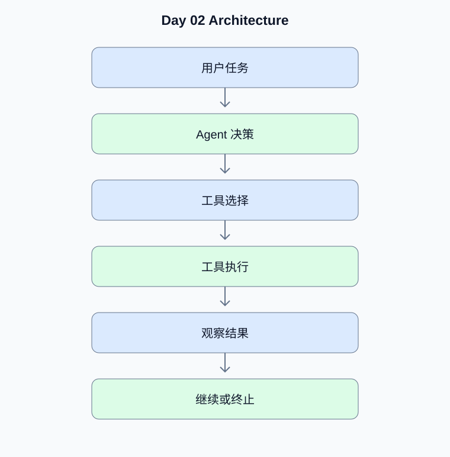

# Day 02：ReAct、工具系统与执行边界

[返回课程主页](../../README.md) · [每日面试题](./interview.md) · [学习进度](./progress.md)

> 学习时间：4–5 小时。今日交付：实现带多工具、终止条件和错误恢复的 ReAct Agent。

## 一、今天要解决什么问题

实现带多工具、终止条件和错误恢复的 ReAct Agent。

学习顺序：原理理解 → 真实代码 → 测试验证 → Python 复习 → 面试训练。

## 二、核心原理

### 1. ReAct 循环

**原理：**ReAct 将推理、行动和观察连接为循环。工程实现不应依赖模型输出自由文本中的思维过程，而应通过结构化工具调用、状态和可观测事件管理执行流程。

**动手验证：**记录每次工具调用的名称、参数摘要、耗时和结果状态。

### 2. 工具注册与执行边界

**原理：**工具需要明确名称、参数 Schema、权限范围、超时、重试策略和副作用。读取类工具与写入类工具应采用不同的权限和审批规则。

**动手验证：**为查询订单和修改订单分别定义权限与幂等策略。

## 三、架构示例图



[查看可编辑的 Mermaid 图表源码](./images/architecture.mmd)

## 四、工程实战

- [ ] 实现三个真实 Python 工具
- [ ] 实现工具注册表与工具 Schema
- [ ] 实现最大工具调用次数
- [ ] 实现工具超时与异常分类
- [ ] 记录完整的工具执行轨迹

### 工程验收要求

- 外部输入必须经过类型、范围和权限校验。
- 模型生成的工具参数不能直接作为可信业务参数。
- 网络调用需要设置超时；有副作用的工具需要考虑幂等。
- 至少编写一个正常场景测试和一个异常场景测试。
- 记录实际运行结果，而不是只保留示例输出。

### 今日代码位置

`src/` 保存当天练习代码，`tests/` 保存测试。
毕业项目的长期代码放在仓库根目录的 `project/` 中。

## 五、Python 高级面试复习


## Python 1：迭代器和生成器有什么区别？

**参考答案：**迭代器实现 __iter__ 和 __next__ 协议；生成器函数使用 yield，调用后返回生成器对象，并在迭代过程中保留执行状态。

**面试官追问：**生成器如何通过 yield from 组合子生成器？

**追问参考答案：**yield from 会把子生成器的迭代值传递给外层调用方，也会转发 send、throw 等交互，并可接收子生成器的返回值。适合组合多个迭代流程，但需要注意异常传播。

**代码示例：**

```python
def child():
    yield 1
    yield 2
    return "完成"

def parent():
    result = yield from child()
    print(result)

assert list(parent()) == [1, 2]
```


## Python 2：上下文管理器如何工作？

**参考答案：**with 调用对象的 __enter__ 和 __exit__，用于保证资源清理。contextlib.contextmanager 可以使用生成器定义上下文管理器。

**面试官追问：**__exit__ 返回 True 对异常传播有什么影响？

**追问参考答案：**__exit__ 返回真值表示异常已被处理，with 语句通常不会继续传播该异常。一般资源管理器应返回 False 或 None，避免意外吞掉业务异常。


## 六、AI Agent 高级面试

本日 Agent 面试题、参考答案和追问见 [interview.md](./interview.md)。

## 七、每日学习记录

完成后更新 [progress.md](./progress.md)，并将实际问题、代码结果和技术取舍写入
[notes.md](./notes.md)。

## 八、今日验收

- [ ] 能独立解释今天的核心原理
- [ ] 完成真实代码和异常场景测试
- [ ] 完成 Python 面试题并回答追问
- [ ] 完成 Agent 面试题
- [ ] 提交当天 Git Commit
