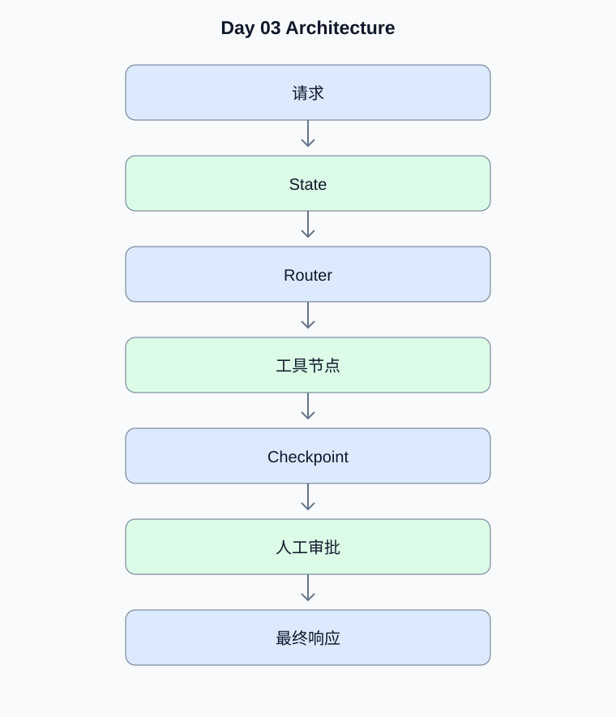

# Day 03：LangGraph、状态机与 asyncio

[返回课程主页](../../README.md) · [每日面试题](./interview.md) · [学习进度](./progress.md)

> 学习时间：4–5 小时。今日交付：实现支持 Router、Checkpoint 和人工审批的状态化 Agent。

## 一、今天要解决什么问题

实现支持 Router、Checkpoint 和人工审批的状态化 Agent。

学习顺序：原理理解 → 真实代码 → 测试验证 → Python 复习 → 面试训练。

## 二、核心原理

### 1. LangGraph 状态图

**原理：**State 保存工作流共享数据；Node 执行一个明确步骤；Edge 定义节点之间的转换；Conditional Edge 根据状态选择下一节点。状态字段的合并行为需要明确，避免并行节点相互覆盖。

**动手验证：**绘制包含检索、工具执行和回答节点的状态图。

### 2. Checkpoint 与人工审批

**原理：**Checkpoint 保存可恢复的执行状态。需要人工审批的节点可以中断，审批后再恢复。外部副作用不能只依赖状态恢复保证恰好执行一次，还需要幂等键或业务事务。

**动手验证：**设计转账审批的中断、恢复和重复执行保护。

## 三、架构示例图



[查看可编辑的 Mermaid 图表源码](./images/architecture.mmd)

## 四、工程实战

- [ ] 建立 LangGraph State 与节点
- [ ] 实现条件 Router
- [ ] 接入真实工具节点
- [ ] 实现持久化 Checkpoint
- [ ] 实现人工审批与恢复测试

### 工程验收要求

- 外部输入必须经过类型、范围和权限校验。
- 模型生成的工具参数不能直接作为可信业务参数。
- 网络调用需要设置超时；有副作用的工具需要考虑幂等。
- 至少编写一个正常场景测试和一个异常场景测试。
- 记录实际运行结果，而不是只保留示例输出。

### 今日代码位置

`src/` 保存当天练习代码，`tests/` 保存测试。
毕业项目的长期代码放在仓库根目录的 `project/` 中。

## 五、Python 高级面试复习


## Python 1：GIL 对线程有什么影响？

**参考答案：**在常见 CPython 构建中，GIL 限制同一解释器内多个线程同时执行Python 字节码，但 I/O 等待和释放 GIL 的扩展代码仍可受益于线程。CPU 密集型任务通常需要进程或适当的原生扩展。

**面试官追问：**asyncio、线程池和进程池分别适合哪些任务？

**追问参考答案：**asyncio 适合大量等待网络或磁盘的 I/O 任务；线程池适合需要兼容同步阻塞库的 I/O 工作；进程池适合纯 Python CPU 密集任务。还要考虑进程间序列化开销和外部服务的并发限制。


## Python 2：asyncio 的取消如何传播？

**参考答案：**取消任务通常通过 CancelledError 传播。协程应在 finally 中清理资源，不要无意吞掉取消异常；TaskGroup 可以管理结构化并发。

**面试官追问：**如何为多个并发工具设置统一超时？

**追问参考答案：**使用 asyncio.TaskGroup 管理任务，配合 asyncio.timeout 设置总超时，使用 Semaphore 限制并发。单个工具还应设置自己的网络超时；取消时在 finally 中释放资源。

**代码示例：**

```python
import asyncio

async def call_tool(name: str, semaphore: asyncio.Semaphore):
    async with semaphore:
        await asyncio.sleep(0.1)
        return name

async def main():
    semaphore = asyncio.Semaphore(3)

    async with asyncio.timeout(5):
        async with asyncio.TaskGroup() as group:
            tasks = [
                group.create_task(call_tool(str(i), semaphore))
                for i in range(10)
            ]

    return [task.result() for task in tasks]

print(asyncio.run(main()))
```


## 六、AI Agent 高级面试

本日 Agent 面试题、参考答案和追问见 [interview.md](./interview.md)。

## 七、每日学习记录

完成后更新 [progress.md](./progress.md)，并将实际问题、代码结果和技术取舍写入
[notes.md](./notes.md)。

## 八、今日验收

- [ ] 能独立解释今天的核心原理
- [ ] 完成真实代码和异常场景测试
- [ ] 完成 Python 面试题并回答追问
- [ ] 完成 Agent 面试题
- [ ] 提交当天 Git Commit
