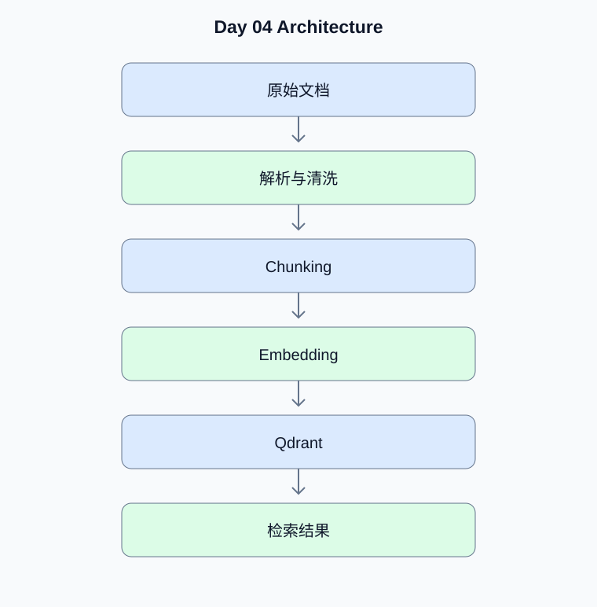

# Day 04：RAG、Embedding、Chunking 与 Qdrant

[返回课程主页](../../README.md) · [每日面试题](./interview.md) · [学习进度](./progress.md)

> 学习时间：4–5 小时。今日交付：建立支持真实文档写入和向量检索的 RAG 服务。

## 一、今天要解决什么问题

建立支持真实文档写入和向量检索的 RAG 服务。

学习顺序：原理理解 → 真实代码 → 测试验证 → Python 复习 → 面试训练。

## 二、核心原理

### 1. RAG 的两个阶段

**原理：**索引阶段负责解析、清洗、分块、生成向量和写入索引；查询阶段负责查询处理、检索、重排序、上下文组装和答案生成。两阶段需要共享文档版本、权限和来源信息。

**动手验证：**为每个 Chunk 保存 document_id、version、source 和 ACL。

### 2. Chunking 策略

**原理：**固定长度分块实现简单，但可能切断语义；按标题或段落分块保留结构，但长度可能不均匀。长文档可使用层级分块，短文档可直接索引。Overlap 应通过评估决定，而非越大越好。

**动手验证：**对短文档、长 PDF 和代码文件设计不同分块规则。

## 三、架构示例图



[查看可编辑的 Mermaid 图表源码](./images/architecture.mmd)

## 四、工程实战

- [ ] 启动真实 Qdrant 服务
- [ ] 接入真实 Embedding 模型
- [ ] 实现文档解析和分块
- [ ] 写入带元数据的向量
- [ ] 实现查询、权限过滤和来源返回

### 工程验收要求

- 外部输入必须经过类型、范围和权限校验。
- 模型生成的工具参数不能直接作为可信业务参数。
- 网络调用需要设置超时；有副作用的工具需要考虑幂等。
- 至少编写一个正常场景测试和一个异常场景测试。
- 记录实际运行结果，而不是只保留示例输出。

### 今日代码位置

`src/` 保存当天练习代码，`tests/` 保存测试。
毕业项目的长期代码放在仓库根目录的 `project/` 中。

## 五、Python 高级面试复习


## Python 1：dict 为什么通常能高效查找？

**参考答案：**dict 基于哈希表，通过键的哈希值定位存储位置。平均查找复杂度通常接近 O(1)，但哈希冲突、扩容和键的哈希质量会影响表现。

**面试官追问：**为什么可变 list 不能直接作为 dict 的键？

**追问参考答案：**list 是可变对象，通常不可哈希，因此不能直接作为 dict 键。字典键要求哈希值在其作为键期间保持稳定，并满足相等对象哈希相等。如果数据本身适合不可变表示，可考虑 tuple。


## Python 2：如何实现高效 Top-K？

**参考答案：**当 K 远小于数据量时，可以使用大小为 K 的最小堆，时间复杂度约为 O(N log K)，避免对全部结果排序。

**面试官追问：**海量检索结果如何在内存受限时求 Top-K？

**追问参考答案：**维护大小为 K 的最小堆，逐条处理输入，当新元素优于堆顶时替换堆顶。空间复杂度为 O(K)，时间复杂度约为 O(N log K)，适合流式数据。

**代码示例：**

```python
import heapq

def top_k(numbers, k):
    if k <= 0:
        return []
    return heapq.nlargest(k, numbers)

assert top_k([5, 1, 9, 3, 7], 3) == [9, 7, 5]
```


## 六、AI Agent 高级面试

本日 Agent 面试题、参考答案和追问见 [interview.md](./interview.md)。

## 七、每日学习记录

完成后更新 [progress.md](./progress.md)，并将实际问题、代码结果和技术取舍写入
[notes.md](./notes.md)。

## 八、今日验收

- [ ] 能独立解释今天的核心原理
- [ ] 完成真实代码和异常场景测试
- [ ] 完成 Python 面试题并回答追问
- [ ] 完成 Agent 面试题
- [ ] 提交当天 Git Commit
