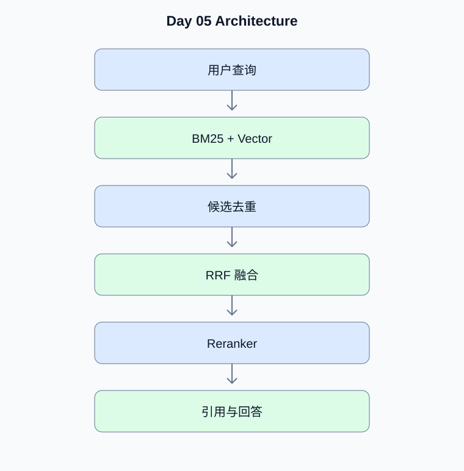

# Day 05：BM25、Hybrid Search、RRF 与 Reranker

[返回课程主页](../../README.md) · [每日面试题](./interview.md) · [学习进度](./progress.md)

> 学习时间：4–5 小时。今日交付：构建支持词法与语义检索融合的高质量 RAG。

## 一、今天要解决什么问题

构建支持词法与语义检索融合的高质量 RAG。

学习顺序：原理理解 → 真实代码 → 测试验证 → Python 复习 → 面试训练。

## 二、核心原理

### 1. BM25 与 Dense Retrieval

**原理：**BM25 根据词频、逆文档频率和文档长度计算相关性，适合精确术语、编号和实体匹配；Dense Retrieval 使用语义向量，适合词面不同但语义相近的查询。

**动手验证：**分别测试产品编号查询与自然语言改写查询。

### 2. RRF 与 Reranker

**原理：**RRF 根据不同检索器中的排名融合候选结果，不要求不同检索器的原始分数可直接比较。Reranker 对查询和候选文档进行更精细的相关性打分，通常放在候选召回之后。

**动手验证：**记录 BM25、Vector、融合和重排各阶段的 Recall@K。

## 三、架构示例图

[查看可编辑的 Mermaid 图表源码](./images/architecture.mmd)

## 四、工程实战

- [ ] 实现 BM25 检索
- [ ] 实现 Qdrant 向量检索
- [ ] 实现 RRF 融合与去重
- [ ] 接入真实 Reranker
- [ ] 构建检索评估集并比较结果

### 工程验收要求

- 外部输入必须经过类型、范围和权限校验。
- 模型生成的工具参数不能直接作为可信业务参数。
- 网络调用需要设置超时；有副作用的工具需要考虑幂等。
- 至少编写一个正常场景测试和一个异常场景测试。
- 记录实际运行结果，而不是只保留示例输出。

### 今日代码位置

`src/` 保存当天练习代码，`tests/` 保存测试。
毕业项目的长期代码放在仓库根目录的 `project/` 中。

## 五、Python 高级面试复习

## Python 1：引用计数和循环 GC 的关系是什么？

**参考答案：**CPython 主要使用引用计数管理对象生命周期，循环垃圾回收用于处理部分引用环。对象持有外部资源时仍应显式关闭，不依赖垃圾回收时机。

**面试官追问：**如何使用 tracemalloc 排查内存增长？

**追问参考答案：**使用 tracemalloc.start() 启动跟踪，在请求前后获取快照，通过 compare_to() 按文件和行号比较内存分配变化。同时检查缓存、全局容器、任务引用和未关闭资源。tracemalloc 不能完整覆盖所有原生扩展的内存分配。

## Python 2：浅拷贝和深拷贝有什么区别？

**参考答案：**浅拷贝创建新的外层容器，但嵌套对象仍共享引用；深拷贝递归复制对象图，并通过 memo 处理共享引用和循环引用。

**面试官追问：**深拷贝为什么不适合随意用于大型 Agent State？

**追问参考答案：**深拷贝大型 Agent State 会增加 CPU 和内存开销，还可能复制不应复制的客户端、连接和锁。更适合使用不可变状态片段、明确的字段更新以及按需复制需要修改的数据。

## 六、AI Agent 高级面试

本日 Agent 面试题、参考答案和追问见 [interview.md](./interview.md)。

## 七、每日学习记录

完成后更新 [progress.md](./progress.md)，并将实际问题、代码结果和技术取舍写入
[notes.md](./notes.md)。

## 八、今日验收

- [ ] 能独立解释今天的核心原理
- [ ] 完成真实代码和异常场景测试
- [ ] 完成 Python 面试题并回答追问
- [ ] 完成 Agent 面试题
- [ ] 提交当天 Git Commit
