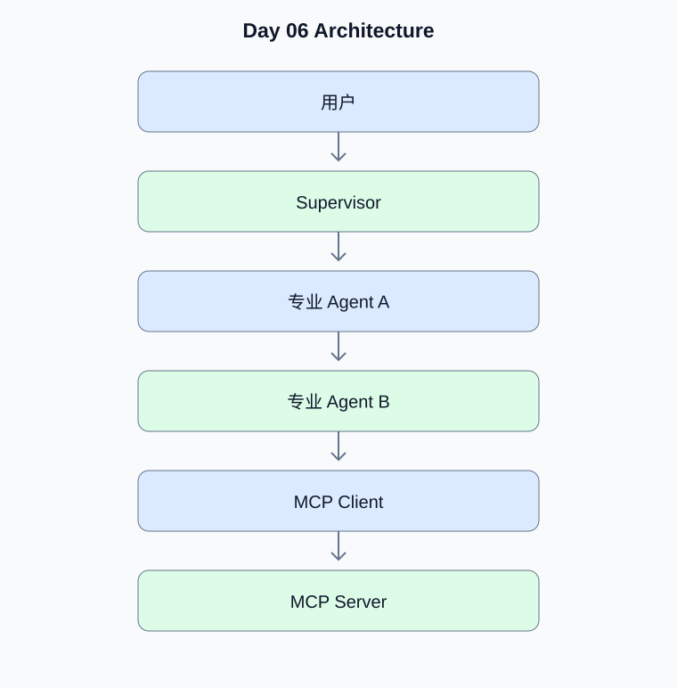

# Day 06：Memory、MCP 与多 Agent

[返回课程主页](../../README.md) · [每日面试题](./interview.md) · [学习进度](./progress.md)

> 学习时间：4–5 小时。今日交付：实现可管理记忆、连接 MCP 工具的多 Agent 系统。

## 一、今天要解决什么问题

实现可管理记忆、连接 MCP 工具的多 Agent 系统。

学习顺序：原理理解 → 真实代码 → 测试验证 → Python 复习 → 面试训练。

## 二、核心原理

### 1. Memory 的层次

**原理：**短期记忆通常服务于当前会话；长期记忆用于跨会话保留经过选择的信息。原始历史、摘要和结构化事实的用途不同，需要考虑过期、纠错、权限和删除机制。

**动手验证：**设计会话摘要的更新与失效策略。

### 2. MCP 与多 Agent

**原理：**MCP 定义模型应用与外部工具、资源等能力之间的标准化交互方式。多 Agent 通过专业化角色分工，但也会带来上下文传递、协作成本和权限扩大风险。

**动手验证：**实现一个 MCP Server，并限制每个子 Agent 可调用的工具。

## 三、架构示例图



[查看可编辑的 Mermaid 图表源码](./images/architecture.mmd)

## 四、工程实战

- [ ] 实现会话记忆与摘要
- [ ] 实现真实 MCP Server
- [ ] 连接 MCP Client 并调用工具
- [ ] 实现 Supervisor 与两个子 Agent
- [ ] 测试工具权限和上下文传递

### 工程验收要求

- 外部输入必须经过类型、范围和权限校验。
- 模型生成的工具参数不能直接作为可信业务参数。
- 网络调用需要设置超时；有副作用的工具需要考虑幂等。
- 至少编写一个正常场景测试和一个异常场景测试。
- 记录实际运行结果，而不是只保留示例输出。

### 今日代码位置

`src/` 保存当天练习代码，`tests/` 保存测试。
毕业项目的长期代码放在仓库根目录的 `project/` 中。

## 五、Python 高级面试复习


## Python 1：HTTP 连接池为什么重要？

**参考答案：**连接池复用连接，减少重复建立连接的成本。需要设置连接数、空闲连接数、连接超时和读取超时，避免外部服务故障耗尽本地资源。

**面试官追问：**连接池满时应该等待、拒绝还是扩容？

**追问参考答案：**连接池满时首先执行有界等待，并设置获取连接的超时。持续过载时应限流或拒绝请求，而不是无限扩容。扩容需要同时考虑下游服务容量、文件描述符和成本。


## Python 2：同步 HTTP 与异步 HTTP 如何选择？

**参考答案：**同步客户端适合简单顺序调用；异步客户端适合大量 I/O 并发。异步并不自动提高单次请求速度，也不能解决远端服务限流。

**面试官追问：**如何为异步 HTTP 客户端设置并发信号量？

**追问参考答案：**使用 asyncio.Semaphore 包裹请求，并在共享的 httpx.AsyncClient 中配置连接池与超时。任务取消时应释放信号量；还需要针对远端 429 设置退避和限流策略。

**代码示例：**

```python
import asyncio
import httpx

async def fetch_all(urls: list[str]):
    semaphore = asyncio.Semaphore(5)

    timeout = httpx.Timeout(10.0)

    async with httpx.AsyncClient(timeout=timeout) as client:
        async def fetch(url: str):
            async with semaphore:
                response = await client.get(url)
                response.raise_for_status()
                return response.text

        return await asyncio.gather(
            *(fetch(url) for url in urls)
        )
```


## 六、AI Agent 高级面试

本日 Agent 面试题、参考答案和追问见 [interview.md](./interview.md)。

## 七、每日学习记录

完成后更新 [progress.md](./progress.md)，并将实际问题、代码结果和技术取舍写入
[notes.md](./notes.md)。

## 八、今日验收

- [ ] 能独立解释今天的核心原理
- [ ] 完成真实代码和异常场景测试
- [ ] 完成 Python 面试题并回答追问
- [ ] 完成 Agent 面试题
- [ ] 提交当天 Git Commit
