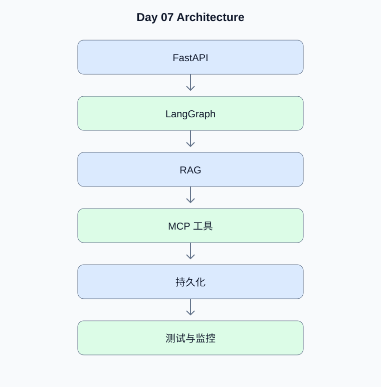

# Day 07：第一阶段集成与架构验收

[返回课程主页](../../README.md) · [每日面试题](./interview.md) · [学习进度](./progress.md)

> 学习时间：4–5 小时。今日交付：将 Agent、RAG、MCP 和 API 集成为可测试的 MVP。

## 一、今天要解决什么问题

将 Agent、RAG、MCP 和 API 集成为可测试的 MVP。

学习顺序：原理理解 → 真实代码 → 测试验证 → Python 复习 → 面试训练。

## 二、核心原理

### 1. 模块边界

**原理：**API 层处理请求和身份，Agent 层编排状态，RAG 层负责检索，工具层处理外部副作用，基础设施层管理持久化和配置。模块边界应反映业务责任。

**动手验证：**绘制请求从 API 到检索、工具和响应的完整链路。

### 2. 验收标准

**原理：**MVP 不等于只在正常路径运行。至少需要输入校验、工具权限、超时、错误返回、日志、核心测试和部署说明。

**动手验证：**为每个关键模块列出正常、异常和恢复场景。

## 三、架构示例图

[查看可编辑的 Mermaid 图表源码](./images/architecture.mmd)

## 四、工程实战

- [ ] 整合前六天的真实服务
- [ ] 建立统一配置与异常处理
- [ ] 完成端到端测试
- [ ] 绘制系统架构图
- [ ] 提交第一阶段 MVP

### 工程验收要求

- 外部输入必须经过类型、范围和权限校验。
- 模型生成的工具参数不能直接作为可信业务参数。
- 网络调用需要设置超时；有副作用的工具需要考虑幂等。
- 至少编写一个正常场景测试和一个异常场景测试。
- 记录实际运行结果，而不是只保留示例输出。

### 今日代码位置

`src/` 保存当天练习代码，`tests/` 保存测试。
毕业项目的长期代码放在仓库根目录的 `project/` 中。

## 五、Python 高级面试复习

## Python 1：如何组织可维护的 Python 项目？

**参考答案：**按职责划分模块，明确依赖方向，避免循环导入。业务逻辑应尽量与 HTTP 框架和具体 SDK 解耦，便于测试与替换实现。

**面试官追问：**什么时候应该引入抽象接口，什么时候会过度设计？

**追问参考答案：**当不同实现确实需要共享稳定契约、便于测试替换时引入接口。如果只有单一实现且没有明确变化点，过早引入多层抽象会增加阅读和维护成本。应根据实际依赖方向和测试需求决定。

## 六、AI Agent 高级面试

本日 Agent 面试题、参考答案和追问见 [interview.md](./interview.md)。

## 七、每日学习记录

完成后更新 [progress.md](./progress.md)，并将实际问题、代码结果和技术取舍写入
[notes.md](./notes.md)。

## 八、今日验收

- [ ] 能独立解释今天的核心原理
- [ ] 完成真实代码和异常场景测试
- [ ] 完成 Python 面试题并回答追问
- [ ] 完成 Agent 面试题
- [ ] 提交当天 Git Commit
