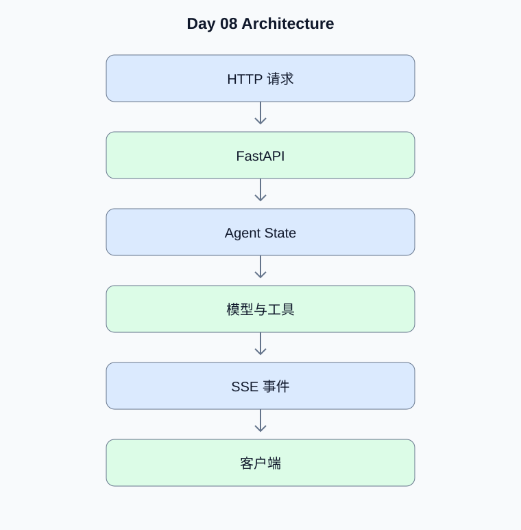

# Day 08：FastAPI、SSE 与持久化 Agent 服务

[返回课程主页](../../README.md) · [每日面试题](./interview.md) · [学习进度](./progress.md)

> 学习时间：4–5 小时。今日交付：实现支持流式响应和会话恢复的 Agent API。

## 一、今天要解决什么问题

实现支持流式响应和会话恢复的 Agent API。

学习顺序：原理理解 → 真实代码 → 测试验证 → Python 复习 → 面试训练。

## 二、核心原理

### 1. SSE 与长任务

**原理：**SSE 适合服务端持续向客户端发送事件。事件需要定义类型、数据格式和结束标记；断线恢复依赖任务状态和事件持久化，而非仅靠连接本身。

**动手验证：**设计 token、tool_start、tool_result、error 和 done 事件。

### 2. 服务生命周期

**原理：**应用启动时创建共享客户端和连接池，关闭时释放资源。请求级状态与应用级资源应分离，避免不同用户会话串扰。

**动手验证：**为模型客户端、数据库连接池和后台任务定义生命周期。

## 三、架构示例图

[查看可编辑的 Mermaid 图表源码](./images/architecture.mmd)

## 四、工程实战

- [ ] 实现 FastAPI Agent API
- [ ] 实现 SSE 流式事件
- [ ] 实现会话状态持久化
- [ ] 实现请求取消与超时
- [ ] 编写 API 集成测试

### 工程验收要求

- 外部输入必须经过类型、范围和权限校验。
- 模型生成的工具参数不能直接作为可信业务参数。
- 网络调用需要设置超时；有副作用的工具需要考虑幂等。
- 至少编写一个正常场景测试和一个异常场景测试。
- 记录实际运行结果，而不是只保留示例输出。

### 今日代码位置

`src/` 保存当天练习代码，`tests/` 保存测试。
毕业项目的长期代码放在仓库根目录的 `project/` 中。

## 五、Python 高级面试复习

## Python 1：ASGI 与 WSGI 的主要区别是什么？

**参考答案：**ASGI 支持异步请求处理和长连接等场景；WSGI 主要面向传统同步 HTTP 请求。实际吞吐还受阻塞调用、连接池和下游服务限制。

**面试官追问：**FastAPI 中同步路由与异步路由如何执行？

**追问参考答案：**FastAPI 的普通同步路由通常由线程池执行，异步路由在事件循环中运行。异步路由内直接调用阻塞函数仍会阻塞事件循环，需要使用异步库或受控线程池。

## Python 2：Pydantic V2 的作用是什么？

**参考答案：**Pydantic 用于数据解析、校验和序列化。边界模型应明确字段类型、长度、范围及额外字段策略。

**面试官追问：**为什么不能只依赖前端进行参数校验？

**追问参考答案：**前端校验可改善用户体验，但请求可以绕过前端直接发送。服务端必须独立验证类型、范围、权限和业务约束，并对数据库写入维持必要约束。

## 六、AI Agent 高级面试

本日 Agent 面试题、参考答案和追问见 [interview.md](./interview.md)。

## 七、每日学习记录

完成后更新 [progress.md](./progress.md)，并将实际问题、代码结果和技术取舍写入
[notes.md](./notes.md)。

## 八、今日验收

- [ ] 能独立解释今天的核心原理
- [ ] 完成真实代码和异常场景测试
- [ ] 完成 Python 面试题并回答追问
- [ ] 完成 Agent 面试题
- [ ] 提交当天 Git Commit
