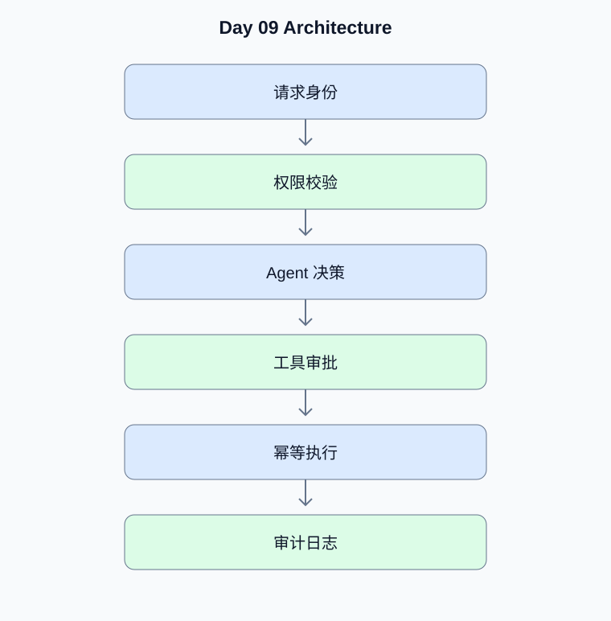

# Day 09：安全、权限、事务与故障恢复

[返回课程主页](../../README.md) · [每日面试题](./interview.md) · [学习进度](./progress.md)

> 学习时间：4–5 小时。今日交付：为 Agent 加入生产环境必需的安全与可靠性机制。

## 一、今天要解决什么问题

为 Agent 加入生产环境必需的安全与可靠性机制。

学习顺序：原理理解 → 真实代码 → 测试验证 → Python 复习 → 面试训练。

## 二、核心原理

### 1. Prompt Injection 与权限边界

**原理：**检索文档、网页和工具返回内容均可能包含恶意指令。不能将低信任内容提升为系统指令；敏感操作必须由确定性权限逻辑校验，而不是仅靠提示词约束。

**动手验证：**测试恶意文档要求 Agent 泄露密钥或越权调用工具的场景。

### 2. 幂等与故障恢复

**原理：**网络重试和状态恢复可能导致工具重复执行。写入操作应使用幂等键、唯一约束或业务事务，并明确超时后结果未知时的查询与补偿流程。

**动手验证：**模拟支付工具超时但远端已成功的情况。

## 三、架构示例图

[查看可编辑的 Mermaid 图表源码](./images/architecture.mmd)

## 四、工程实战

- [ ] 实现身份认证与租户隔离
- [ ] 实现工具级权限校验
- [ ] 实现写入工具幂等键
- [ ] 实现超时与重试策略
- [ ] 完成 Prompt Injection 与故障注入测试

### 工程验收要求

- 外部输入必须经过类型、范围和权限校验。
- 模型生成的工具参数不能直接作为可信业务参数。
- 网络调用需要设置超时；有副作用的工具需要考虑幂等。
- 至少编写一个正常场景测试和一个异常场景测试。
- 记录实际运行结果，而不是只保留示例输出。

### 今日代码位置

`src/` 保存当天练习代码，`tests/` 保存测试。
毕业项目的长期代码放在仓库根目录的 `project/` 中。

## 五、Python 高级面试复习

## Python 1：数据库事务的 ACID 是什么？

**参考答案：**ACID 分别是原子性、一致性、隔离性和持久性。实际隔离行为由数据库和事务隔离级别决定。

**面试官追问：**可重复读是否一定能防止所有并发异常？

**追问参考答案：**不一定。隔离级别的具体语义依赖数据库实现。例如快照隔离可能仍出现写偏斜。需要根据业务不变量选择约束、显式锁、可串行化隔离或冲突检测。

## Python 2：数据库索引有什么代价？

**参考答案：**索引加速部分查询，但占用空间，并增加写入和维护成本。索引设计需要结合查询条件、排序、选择性和执行计划。

**面试官追问：**为什么创建索引后查询仍可能全表扫描？

**追问参考答案：**优化器可能认为全表扫描成本更低，例如表很小、条件选择性差或统计信息不准确。还应检查查询是否使用了索引前缀、是否存在类型转换，并使用 EXPLAIN 分析执行计划。

## 六、AI Agent 高级面试

本日 Agent 面试题、参考答案和追问见 [interview.md](./interview.md)。

## 七、每日学习记录

完成后更新 [progress.md](./progress.md)，并将实际问题、代码结果和技术取舍写入
[notes.md](./notes.md)。

## 八、今日验收

- [ ] 能独立解释今天的核心原理
- [ ] 完成真实代码和异常场景测试
- [ ] 完成 Python 面试题并回答追问
- [ ] 完成 Agent 面试题
- [ ] 提交当天 Git Commit
