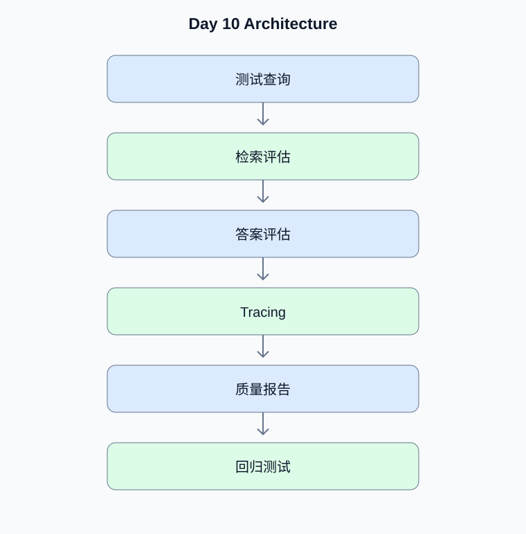

# Day 10：RAG Evaluation 与可观测性

[返回课程主页](../../README.md) · [每日面试题](./interview.md) · [学习进度](./progress.md)

> 学习时间：4–5 小时。今日交付：建立可以持续评估和定位故障的 Agent 质量体系。

## 一、今天要解决什么问题

建立可以持续评估和定位故障的 Agent 质量体系。

学习顺序：原理理解 → 真实代码 → 测试验证 → Python 复习 → 面试训练。

## 二、核心原理

### 1. 检索评估

**原理：**Recall@K 衡量相关文档是否进入前 K 个候选；MRR 关注第一个相关结果的排名；NDCG 适合考虑不同相关性等级和排名位置的场景。

**动手验证：**为不同查询类型建立带相关性标注的评估集。

### 2. Agent 可观测性

**原理：**一次请求需要串联模型调用、检索、重排、工具执行和数据库操作。记录 Trace ID、耗时、错误类型和成本，同时避免在日志中泄露用户隐私或密钥。

**动手验证：**设计检索失败、工具失败和模型失败的不同告警指标。

## 三、架构示例图

[查看可编辑的 Mermaid 图表源码](./images/architecture.mmd)

## 四、工程实战

- [ ] 建立带标注的检索评估集
- [ ] 实现 Recall@K 与 MRR
- [ ] 记录 Agent 工具成功率
- [ ] 接入 Trace ID 与结构化日志
- [ ] 建立质量回归测试

### 工程验收要求

- 外部输入必须经过类型、范围和权限校验。
- 模型生成的工具参数不能直接作为可信业务参数。
- 网络调用需要设置超时；有副作用的工具需要考虑幂等。
- 至少编写一个正常场景测试和一个异常场景测试。
- 记录实际运行结果，而不是只保留示例输出。

### 今日代码位置

`src/` 保存当天练习代码，`tests/` 保存测试。
毕业项目的长期代码放在仓库根目录的 `project/` 中。

## 五、Python 高级面试复习

## Python 1：Redis 缓存穿透、击穿与雪崩如何区分？

**参考答案：**穿透是请求大量不存在的数据；击穿是热点键失效后大量请求同时回源；雪崩是大量键集中失效或缓存服务故障。

**面试官追问：**如何组合空值缓存、互斥更新和随机 TTL？

**追问参考答案：**空值缓存可以降低不存在数据的重复回源；热点键可以使用互斥更新或逻辑过期；大量键使用随机 TTL 错峰。还需要限流、降级和缓存服务故障预案。

## 六、AI Agent 高级面试

本日 Agent 面试题、参考答案和追问见 [interview.md](./interview.md)。

## 七、每日学习记录

完成后更新 [progress.md](./progress.md)，并将实际问题、代码结果和技术取舍写入
[notes.md](./notes.md)。

## 八、今日验收

- [ ] 能独立解释今天的核心原理
- [ ] 完成真实代码和异常场景测试
- [ ] 完成 Python 面试题并回答追问
- [ ] 完成 Agent 面试题
- [ ] 提交当天 Git Commit
