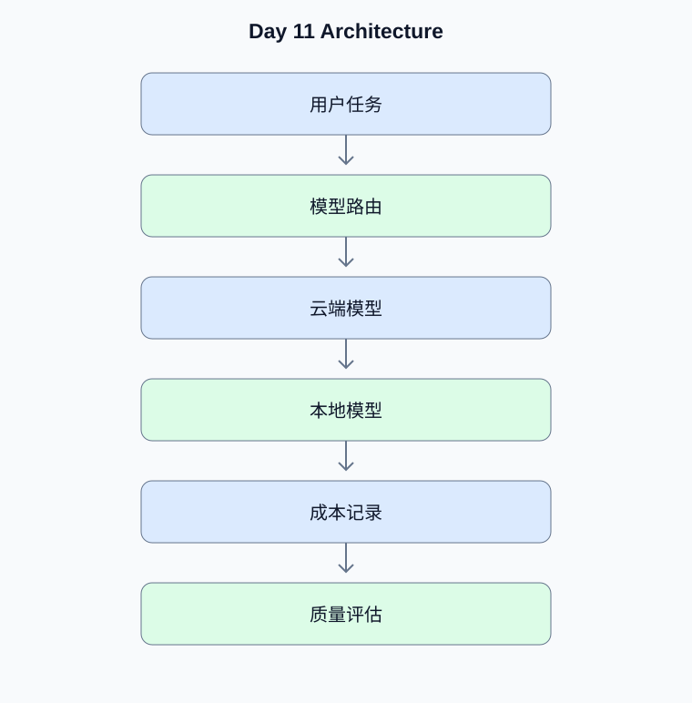

# Day 11：模型路由、推理性能与成本优化

[返回课程主页](../../README.md) · [每日面试题](./interview.md) · [学习进度](./progress.md)

> 学习时间：4–5 小时。今日交付：建立云端和本地模型的路由与成本监控机制。

## 一、今天要解决什么问题

建立云端和本地模型的路由与成本监控机制。

学习顺序：原理理解 → 真实代码 → 测试验证 → Python 复习 → 面试训练。

## 二、核心原理

### 1. 模型路由

**原理：**可以根据任务复杂度、隐私要求、延迟预算、成本预算和工具调用能力选择模型。路由策略应可观测、可回退、可通过评估数据验证。

**动手验证：**为简单分类、复杂推理和敏感数据分别定义路由规则。

### 2. 上下文与缓存

**原理：**上下文越长不一定效果越好。应优先改善检索质量、压缩无关历史、限制工具输出，并区分精确缓存和语义缓存的正确性风险。

**动手验证：**比较不同上下文长度下的准确率、延迟与成本。

## 三、架构示例图

[查看可编辑的 Mermaid 图表源码](./images/architecture.mmd)

## 四、工程实战

- [ ] 实现云端与本地模型路由
- [ ] 记录 Token 与请求成本
- [ ] 限制并发与上下文长度
- [ ] 建立延迟基线
- [ ] 比较优化前后的质量与成本

### 工程验收要求

- 外部输入必须经过类型、范围和权限校验。
- 模型生成的工具参数不能直接作为可信业务参数。
- 网络调用需要设置超时；有副作用的工具需要考虑幂等。
- 至少编写一个正常场景测试和一个异常场景测试。
- 记录实际运行结果，而不是只保留示例输出。

### 今日代码位置

`src/` 保存当天练习代码，`tests/` 保存测试。
毕业项目的长期代码放在仓库根目录的 `project/` 中。

## 五、Python 高级面试复习

## Python 1：如何实现有界生产者消费者队列？

**参考答案：**使用有最大容量的队列提供背压，生产者在队列满时等待或拒绝，消费者按并发限制处理任务。

**面试官追问：**如何在服务关闭时安全地处理队列中的任务？

**追问参考答案：**停止接收新任务，等待已接收任务在规定时间内完成，对未完成任务进行持久化或明确失败处理。使用任务确认机制避免任务丢失，并通过幂等键处理重试造成的重复执行。

## 六、AI Agent 高级面试

本日 Agent 面试题、参考答案和追问见 [interview.md](./interview.md)。

## 七、每日学习记录

完成后更新 [progress.md](./progress.md)，并将实际问题、代码结果和技术取舍写入
[notes.md](./notes.md)。

## 八、今日验收

- [ ] 能独立解释今天的核心原理
- [ ] 完成真实代码和异常场景测试
- [ ] 完成 Python 面试题并回答追问
- [ ] 完成 Agent 面试题
- [ ] 提交当天 Git Commit
