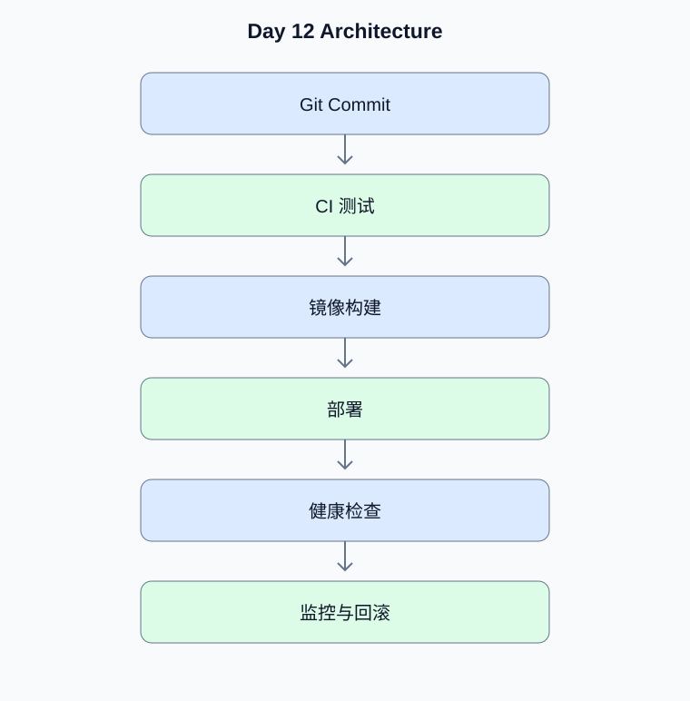

# Day 12：Docker、CI/CD 与生产部署

[返回课程主页](../../README.md) · [每日面试题](./interview.md) · [学习进度](./progress.md)

> 学习时间：4–5 小时。今日交付：将 Agent 系统容器化并建立自动化验收流程。

## 一、今天要解决什么问题

将 Agent 系统容器化并建立自动化验收流程。

学习顺序：原理理解 → 真实代码 → 测试验证 → Python 复习 → 面试训练。

## 二、核心原理

### 1. 容器化

**原理：**镜像应固定依赖版本、使用非 root 用户、减少构建上下文并避免打包密钥。模型、数据库和向量数据库需要分别考虑资源与持久化。

**动手验证：**检查 Dockerfile 中的密钥、权限和健康检查。

### 2. CI/CD 与发布

**原理：**流水线至少包含静态检查、单元测试、集成测试和部署前检查。数据库迁移与服务发布需要考虑兼容窗口和回滚。

**动手验证：**设计新旧版本同时运行时的数据库 Schema 兼容方案。

## 三、架构示例图

[查看可编辑的 Mermaid 图表源码](./images/architecture.mmd)

## 四、工程实战

- [ ] 编写 Dockerfile 与 Compose
- [ ] 配置环境变量和密钥管理
- [ ] 配置健康检查
- [ ] 建立 CI 测试流程
- [ ] 完成部署和回滚演练

### 工程验收要求

- 外部输入必须经过类型、范围和权限校验。
- 模型生成的工具参数不能直接作为可信业务参数。
- 网络调用需要设置超时；有副作用的工具需要考虑幂等。
- 至少编写一个正常场景测试和一个异常场景测试。
- 记录实际运行结果，而不是只保留示例输出。

### 今日代码位置

`src/` 保存当天练习代码，`tests/` 保存测试。
毕业项目的长期代码放在仓库根目录的 `project/` 中。

## 五、Python 高级面试复习

## Python 1：Linux 文件描述符耗尽会造成什么问题？

**参考答案：**文件、Socket 和管道等会占用文件描述符。泄漏或并发过高可能导致无法建立新连接或打开文件。

**面试官追问：**如何定位没有正确关闭的 HTTP 连接？

**追问参考答案：**检查客户端是否复用、响应体是否正确关闭、是否在异常路径释放连接。结合进程文件描述符数量、连接状态、客户端连接池指标和请求 Trace 定位泄漏。

## 六、AI Agent 高级面试

本日 Agent 面试题、参考答案和追问见 [interview.md](./interview.md)。

## 七、每日学习记录

完成后更新 [progress.md](./progress.md)，并将实际问题、代码结果和技术取舍写入
[notes.md](./notes.md)。

## 八、今日验收

- [ ] 能独立解释今天的核心原理
- [ ] 完成真实代码和异常场景测试
- [ ] 完成 Python 面试题并回答追问
- [ ] 完成 Agent 面试题
- [ ] 提交当天 Git Commit
