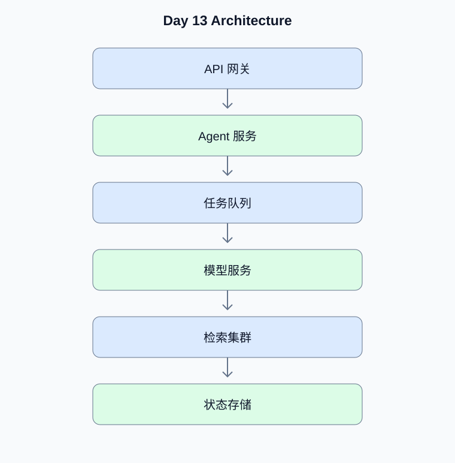

# Day 13：高级 Agent 系统设计

[返回课程主页](../../README.md) · [每日面试题](./interview.md) · [学习进度](./progress.md)

> 学习时间：4–5 小时。今日交付：完成百万文档、多租户和高并发 Agent 平台的系统设计。

## 一、今天要解决什么问题

完成百万文档、多租户和高并发 Agent 平台的系统设计。

学习顺序：原理理解 → 真实代码 → 测试验证 → Python 复习 → 面试训练。

## 二、核心原理

### 1. 容量估算

**原理：**先确定文档量、Chunk 数、向量维度、并发请求、查询峰值和数据更新频率，再估算索引、存储、模型吞吐与成本。不要脱离业务指标直接选型。

**动手验证：**为百万文档场景给出可解释的容量估算假设。

### 2. 多租户隔离

**原理：**租户隔离需要贯穿身份、数据库查询、向量检索、缓存键、工具权限和日志。仅在提示词中加入租户 ID不能构成可靠隔离。

**动手验证：**设计跨租户访问的自动化安全测试。

## 三、架构示例图

[查看可编辑的 Mermaid 图表源码](./images/architecture.mmd)

## 四、工程实战

- [ ] 设计百万文档 RAG 架构
- [ ] 设计多租户权限模型
- [ ] 完成容量估算
- [ ] 设计高可用与故障恢复
- [ ] 进行模拟系统设计面试

### 工程验收要求

- 外部输入必须经过类型、范围和权限校验。
- 模型生成的工具参数不能直接作为可信业务参数。
- 网络调用需要设置超时；有副作用的工具需要考虑幂等。
- 至少编写一个正常场景测试和一个异常场景测试。
- 记录实际运行结果，而不是只保留示例输出。

### 今日代码位置

`src/` 保存当天练习代码，`tests/` 保存测试。
毕业项目的长期代码放在仓库根目录的 `project/` 中。

## 五、Python 高级面试复习

## Python 1：如何定位高并发 Python 服务的瓶颈？

**参考答案：**先观察请求延迟分布、CPU、内存、事件循环阻塞、连接池、数据库慢查询和下游模型耗时，再针对瓶颈进行压测与优化。

**面试官追问：**CPU 很低但接口很慢，优先检查什么？

**追问参考答案：**优先检查外部模型和数据库耗时、连接池等待、锁竞争、队列排队、网络重试和事件循环阻塞。使用分布式 Trace 分解请求延迟，避免在缺少证据时盲目增加 CPU。

## 六、AI Agent 高级面试

本日 Agent 面试题、参考答案和追问见 [interview.md](./interview.md)。

## 七、每日学习记录

完成后更新 [progress.md](./progress.md)，并将实际问题、代码结果和技术取舍写入
[notes.md](./notes.md)。

## 八、今日验收

- [ ] 能独立解释今天的核心原理
- [ ] 完成真实代码和异常场景测试
- [ ] 完成 Python 面试题并回答追问
- [ ] 完成 Agent 面试题
- [ ] 提交当天 Git Commit
