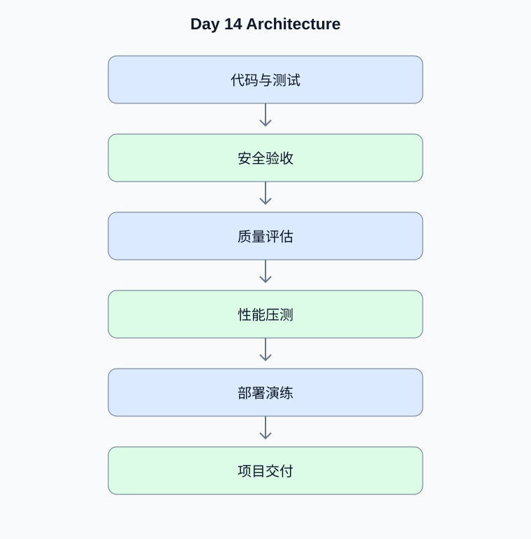

# Day 14：毕业项目验收与高级模拟面试

[返回课程主页](../../README.md) · [每日面试题](./interview.md) · [学习进度](./progress.md)

> 学习时间：4–5 小时。今日交付：完成项目交付、质量验收和高级岗位面试准备。

## 一、今天要解决什么问题

完成项目交付、质量验收和高级岗位面试准备。

学习顺序：原理理解 → 真实代码 → 测试验证 → Python 复习 → 面试训练。

## 二、核心原理

### 1. 项目验收

**原理：**毕业项目需要有可复现的部署方式、真实集成测试、权限测试、质量评估、性能基线、可观测性和故障恢复说明。

**动手验证：**将所有验收项整理为可执行的检查清单。

### 2. 项目表达

**原理：**高级面试重点不是罗列框架，而是说明业务问题、技术选择、关键难点、验证方式、实际结果和仍存在的限制。

**动手验证：**准备 3 分钟、10 分钟和 30 分钟三个版本的项目介绍。

## 三、架构示例图

[查看可编辑的 Mermaid 图表源码](./images/architecture.mmd)

## 四、工程实战

- [ ] 完成全部单元与集成测试
- [ ] 完成安全和权限检查
- [ ] 完成性能与成本报告
- [ ] 整理项目 README 和架构图
- [ ] 完成 Python 与 Agent 综合模拟面试

### 工程验收要求

- 外部输入必须经过类型、范围和权限校验。
- 模型生成的工具参数不能直接作为可信业务参数。
- 网络调用需要设置超时；有副作用的工具需要考虑幂等。
- 至少编写一个正常场景测试和一个异常场景测试。
- 记录实际运行结果，而不是只保留示例输出。

### 今日代码位置

`src/` 保存当天练习代码，`tests/` 保存测试。
毕业项目的长期代码放在仓库根目录的 `project/` 中。

## 五、Python 高级面试复习

## Python 1：高级 Python 面试如何展示工程能力？

**参考答案：**围绕真实问题解释并发、内存、数据库、网络、测试和生产故障排查的取舍，用可复现的数据说明优化效果，避免只背诵定义。

**面试官追问：**如何解释一次实际的线上性能优化过程？

**追问参考答案：**按背景、瓶颈证据、优化方案、风险控制和最终指标组织回答。例如说明优化前后的 P95 延迟、吞吐、CPU 或成本，并解释如何通过压测和监控确认改善不是偶然波动。

## 六、AI Agent 高级面试

本日 Agent 面试题、参考答案和追问见 [interview.md](./interview.md)。

## 七、每日学习记录

完成后更新 [progress.md](./progress.md)，并将实际问题、代码结果和技术取舍写入
[notes.md](./notes.md)。

## 八、今日验收

- [ ] 能独立解释今天的核心原理
- [ ] 完成真实代码和异常场景测试
- [ ] 完成 Python 面试题并回答追问
- [ ] 完成 Agent 面试题
- [ ] 提交当天 Git Commit
